= Entropy微商城

== 注册用户
第一步：打开微信，点击右上角“+”，找到扫一扫，扫描花田花艺的商城二维码。

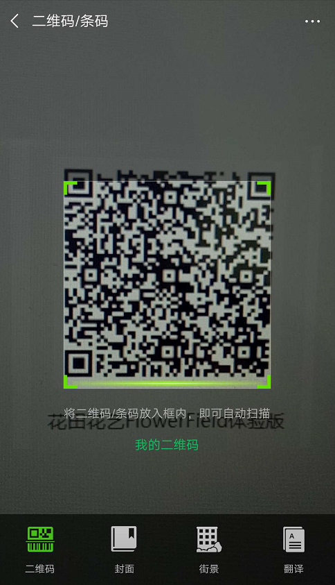
第二步：点击授权，允许，使用微信号绑定的手机号或者其他手机号，完成注册进入微商城首页。

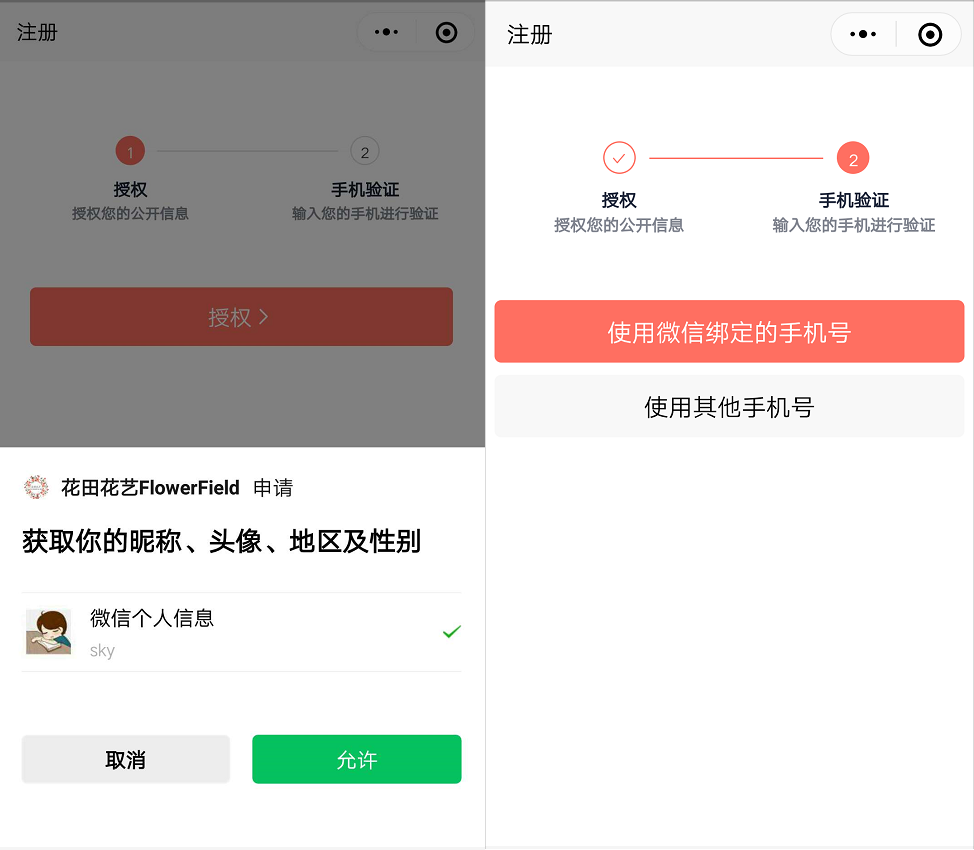
== 添加购买地址
第一步：切换到个人中心，点击“我的地址”

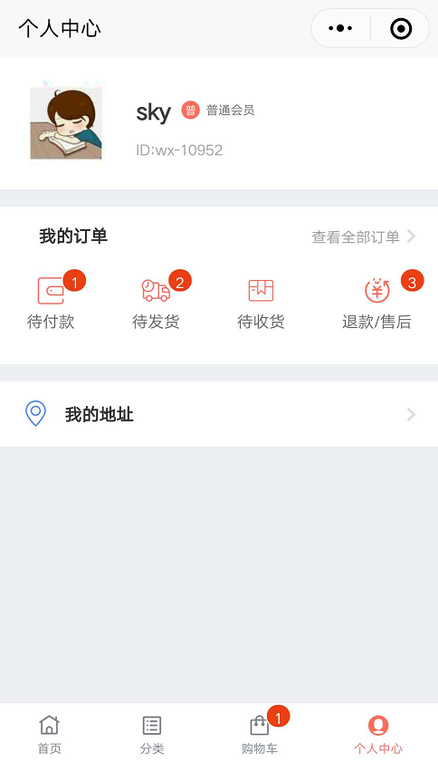
第二步：点击“添加新地址”切换到“编辑地址”窗口，添加收货人姓名，联系方式、所在地区、详细地址等。

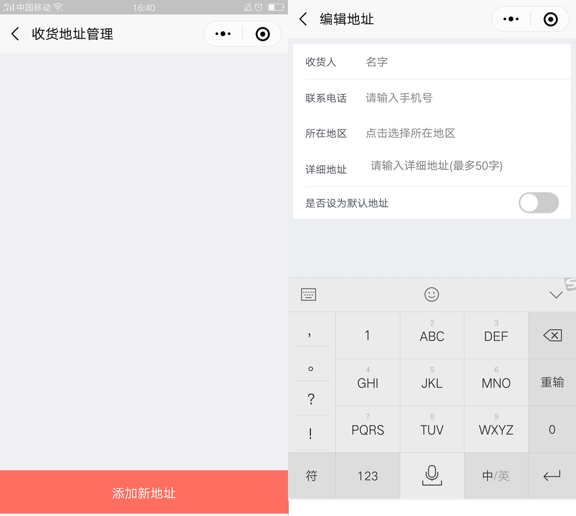
第三步：点击确定按钮，添加购买地址。

== 购买商品
第一步：在首页或者切换到分类下滑动页面，浏览商品。

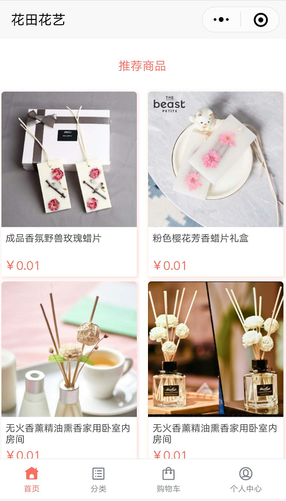
第二步：选择购买商品，点击商品图片进入“商品详情”。

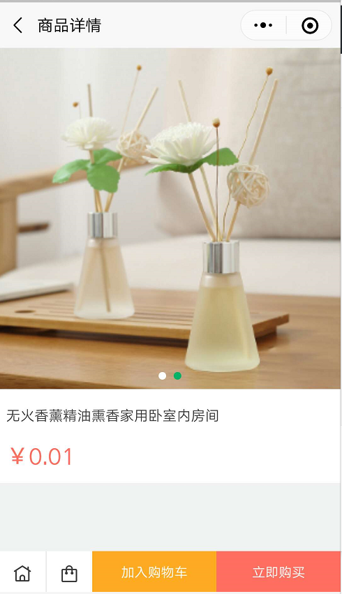
第三步：点击“加入购物车”或“立即购买”，选择商品规格，累加购买数量，点击“确定”按钮。

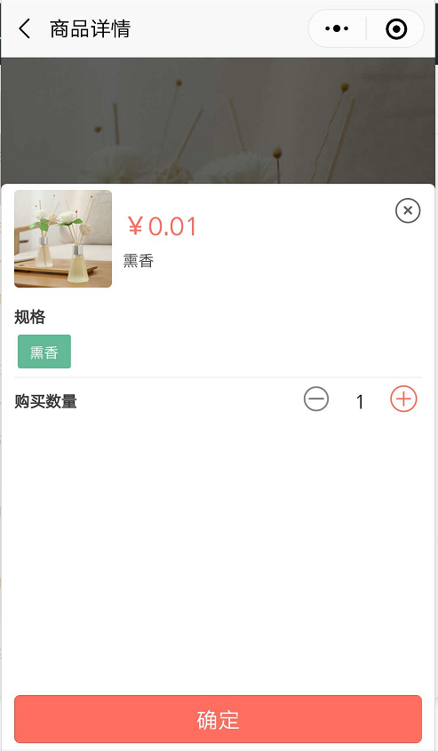
第四步：切换到购物车，勾选商品，点击“+”,增加购买数量， 点击“立即结算”。（注：如选择的是立即购买，则可以直接提交购买订单）。

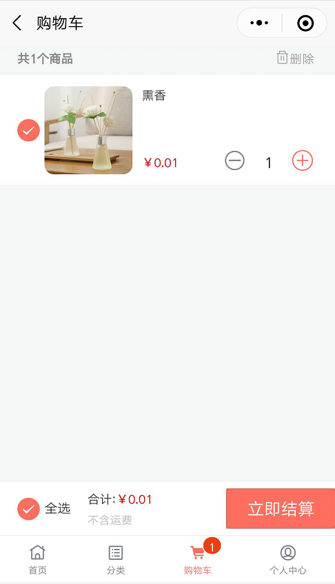
第五步：输入备注、卡片寄语，选择送达日期。（送达日期必须选，其他可选填）点击“提交订单”。

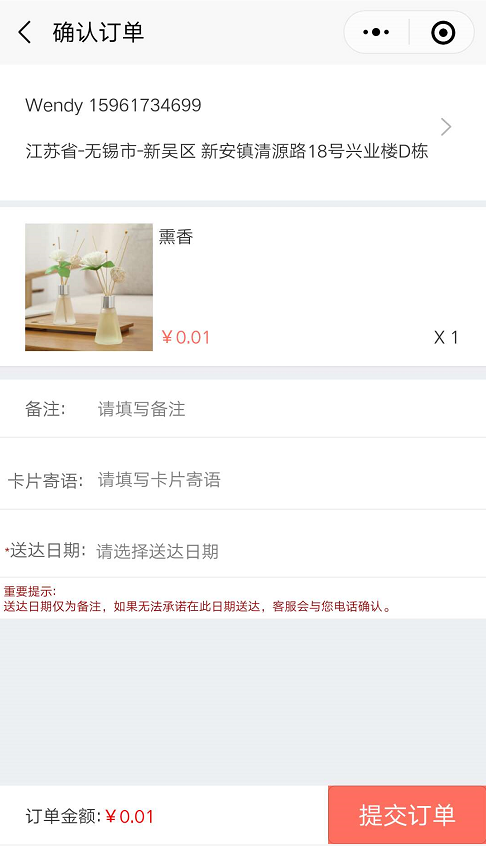
第六步：输入支付密码，购买成功。

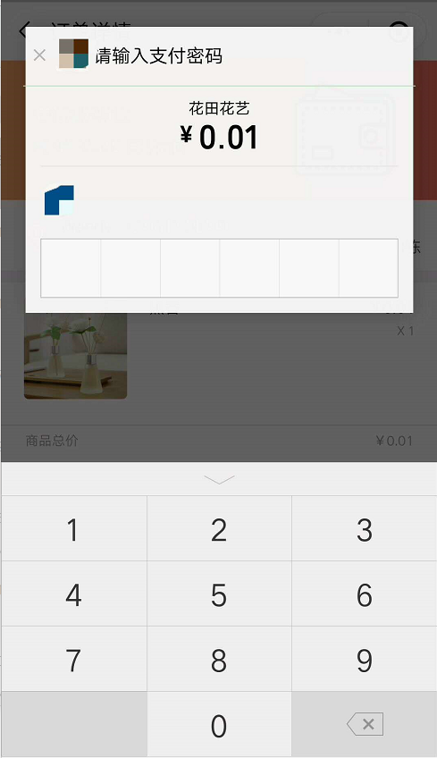

== 售后服务
第一步：切换到个人中心，选择需要售后服务的单据类型。（注：在此举一个待发货单据类型执行售后服务的例子）

第二步：点击“待发货”，打开“待收货”选项卡。

第三步：选择一个订单点击进入“订单详情”，点击“退款”或“批量退款”按钮。

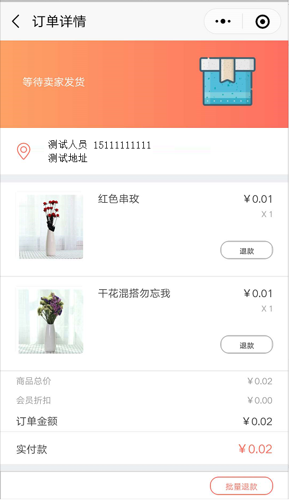
第四步：点击“仅退款”按钮切换到“申请退款”窗口。

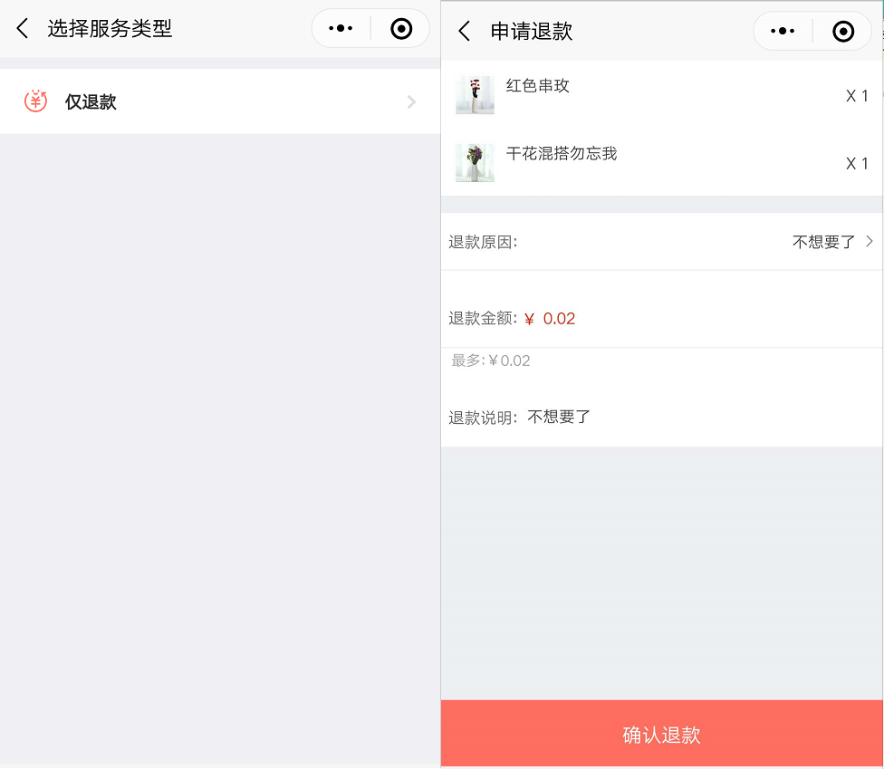
第五步：选择退款原因，输入退款说明，点击“确认退款”按钮。

== 确认收货
第一步：切换到“个人中心”，点击“待收货”。

第二步： 找到对应订单，点击“确认收货”或者点击订单进入订单详情，点击“确认收货”按钮。

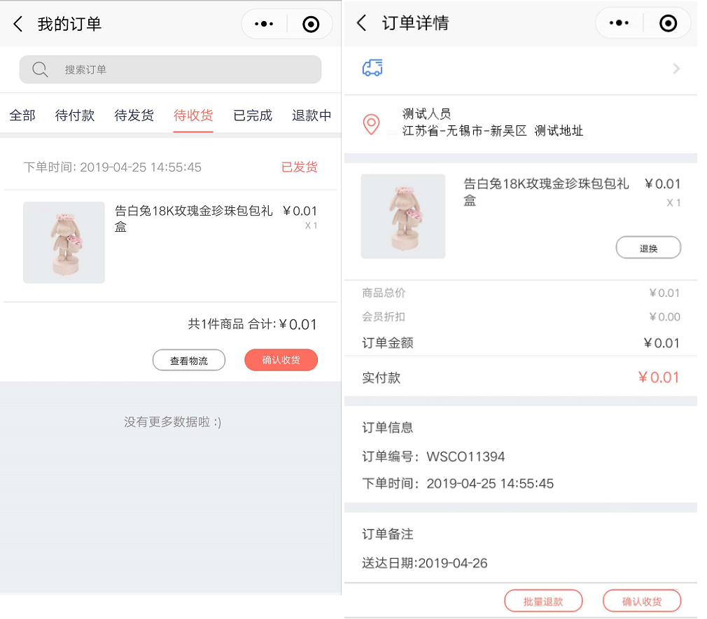

